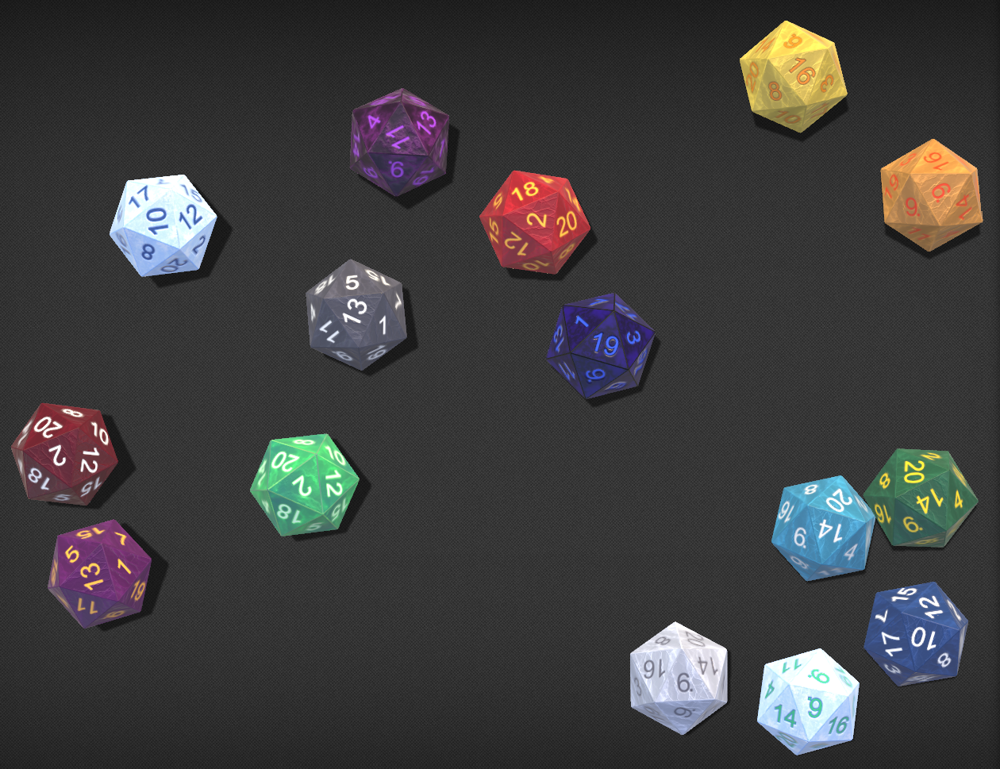

# Cosmere RPG: Community Dice-So-Nice Themes

This is a FoundryVTT module that provides several dice themes for the Dice-So-Nice module. They are
based on the various Radiant Orders and the various kinds of light that exist on Roshar.



## Installation
You can most easily install this module through FoundryVTT's built in module manager. Simply search
for "Cosmere RPG" and select the "Install" button on the card.

To install manually, paste this link into your FoundryVTT module installation dialog at the bottom
where it has box for manual installs.

[`https://raw.githubusercontent.com/damccull/cosmere-rpg-community-dice-themes/refs/heads/master/module.json`](https://raw.githubusercontent.com/damccull/cosmere-rpg-community-dice-themes/refs/heads/master/module.json)

FoundryVTT has now installed it for you.

## Questions
At least one person has asked each of these questions:

1. Should I use this module or DocSun's settings backup?
    - [DocSun's settings backup][docsun-settings-backup] works only for the user importing the settings,
    so everyone will need to do it individually. This does, however, include his special effect settings
    as well. It also overwrites any customized settings you've set up in your Dice-So-Nice settings panel
    so you will need to **save and export** your own settings prior to importing these if you want to
    recover them later.
    - This module is a one-time install for all players, made by the server admin and enabled per world
    just like any other module. Once the GM has enabled it for the world, any player can just select
    the dice they want. The downside is that the Dice-So-Nice API does not currently allow for dice
    presets to contain special effect settings, so you will need to set any special effects yourself
    in the Special Effects tab.
2. Why isn't the Fudge Die styled?
    - The fudge die is not used in the Cosmere RPG so it was not deemed necessary to style. It will
    only be visible in the Dice-So-Nice configuration panel unless you choose to roll it anyway. It
    requires a special-case handling, like the Plot Die does, but if there is a desire, this one
    can be styled as well.
3. Why are there Dice Presets _and_ Themes named the same?
    - The dice presets just give you a pre-determined style of dice, as the contributors designed them
    to look. You can not further customize these.
    - The _themes_ give you the ability to choose a base theme and then make modifications to it under
    the custom settings below. To do this, choose "Cosmere RPG" for the presets, the select your color
    choice from the Themes menu, then you can use the custom settings below to modify the look from
    the base.

## Contributing

### Wish list

* Themes based on:
    * Mistborn
    * White Sands
    * Elantris
    * Any of Brandon Sanderson's other novels
    * NOTE: Each set of themes should get its own const. If we get more than Stormlight Archive, this script
will need a small modification to allow this.
* If possible, some way to programmatically add Dice-So-Nice's special effects when a theme is chosen would
be really nice.

### Instructions
If you would like to contribute, this module is super simple. Start by forking this repo, clone
it to your computer, then modify cosmere-dice.js.

In it, you will create a new constant. Sort it alphabetically. This needs to unique as both a 
constant name and the value. It defines the id your theme will use.

```js
const THEME_YOUR_THEME_NAME = "your_theme_name";
```

Then, keeping it alphabetical, add your theme settings the THEMES constant:

```js
const THEMES = {
  //...
  [THEME_YOUR_THEME_NAME]: {
    description: 'Your Theme Name',
    system: THEME_YOUR_THEME_NAME,
    colorset: {
      name: THEME_YOUR_THEME_NAME,
      description: 'Your Theme Name',
      category: DSN_GROUP,
      foreground: '#294783',
      background: '#dce5f4',
      outline: '#3e6ac1',
      edge: '#c4d6f8',
      texture: 'bronze03a',
      material: 'glass',
      font: 'Arial',
      visibility: 'visible'
    },
  },
  //...
}
```

## Credits

[Doc-Sun](https://github.com/Doc-Sun)
* Originally designed many super nice dice themes.
* Themes
    * Bondsmith
    * Dustbringer
    * Edgedancer
    * Elsecaller
    * Lifelight
    * Lightweaver
    * Skybreaker
    * Stoneward
    * Stormlight
    * Towerlight
    * Truthwatcher
    * Voidlight
    * Warlight
    * Willshaper
    * Windrunner

[damccull](https://github.com/damccull)
* Converted Doc-Sun's themes to a module
* Themes
    * Anti-Stormlight - Modification of Doc-Sun's Stormlight


[docsun-settings-backup]: https://discord.com/channels/1299110557689053264/1375691784507883520/1375691784507883520
